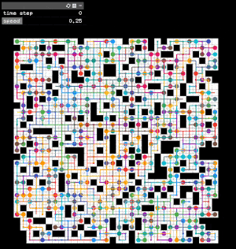

lacam2
---
[](LICENSE)
[](https://github.com/Kei18/lacam2/actions/workflows/ci.yml)

Do you want the power?
LaCAM* could be the answer.

This is a code repository of the paper ["Improving LaCAM for Scalable Eventually Optimal Multi-Agent Pathfinding"](https://kei18.github.io/lacam2/) (IJCAI-23), extended from from [the LaCAM repo](https://kei18.github.io/lacam/) presented at AAAI-23.

## Building

All you need is [CMake](https://cmake.org/) (≥v3.16). The code is written in C++(17).

First, clone this repo with submodules.

```sh
git clone --recursive https://github.com/Kei18/lacam2.git && cd lacam2
```

Then, build the project.

```sh
cmake -B build && make -C build
```

You can also use the [docker](https://www.docker.com/) environment (based on Ubuntu18.04) instead of the native one.
An example setup is available in `assets/`.

## Usage

no optimization (random starts/goals):

```sh
> build/main -v 1 -m assets/random-32-32-20.map -N 400
solved: 31ms    makespan: 112 (lb=58, ub=1.94)  sum_of_costs: 31373 (lb=9217, ub=3.41)  sum_of_loss: 26001 (lb=9217, ub=2.83)

# with the MAPF visualizer mentioned below
> mapf-visualizer map/random-32-32-20.map build/result.txt
```



makespan optimization:

```sh
> build/main -m assets/loop.map -i assets/loop.scen -N 3 -v 1 --objective 1
solved: 8ms     makespan: 10 (lb=2, ub=5)       sum_of_costs: 21 (lb=5, ub=4.2) sum_of_loss: 21 (lb=5, ub=4.2)
```

sum-of-loss optimization:

```sh
> build/main -m assets/loop.map -i assets/loop.scen -N 3 -v 2 --objective 2
solved: 1ms     makespan: 11 (lb=2, ub=5.5)     sum_of_costs: 15 (lb=5, ub=3)   sum_of_loss: 15 (lb=5, ub=3)
```

You can find details of all parameters with:
```sh
build/main --help
```

## Visualizer

This repository is compatible with [@Kei18/mapf-visualizer](https://github.com/kei18/mapf-visualizer).

## Experiments

[](https://github.com/Kei18/lacam2/releases/tag/v0.1)

The experimental script is written in Julia ≥1.7.
Setup may require around 10 minutes.

```sh
sh scripts/setup.sh
```

Edit the config file as you like.
Examples are in `scripts/config` .
The evaluation starts by following commands.

```
julia --project=scripts/ --threads=auto
> include("scripts/eval.jl"); main("scripts/config/mapf-bench.yaml")
```

LaCAM* variants are available in [tags](https://github.com/Kei18/lacam2/tags).

## Notes

- The grid maps and scenarios in `assets/` are from [MAPF benchmarks](https://movingai.com/benchmarks/mapf.html).
- `tests/` is not comprehensive. It was used in early developments.
- Auto formatting (clang-format) when committing:

```sh
git config core.hooksPath .githooks && chmod a+x .githooks/pre-commit
```

## Licence

This software is released under the MIT License, see [LICENSE.txt](LICENCE.txt).
